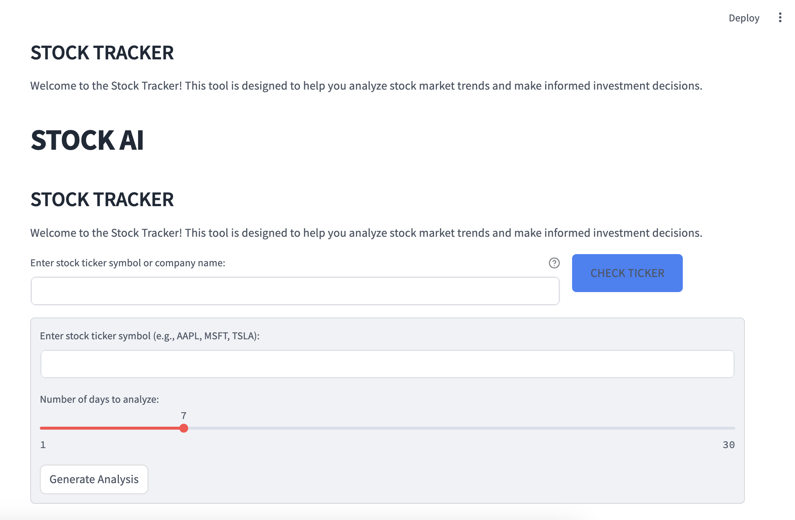
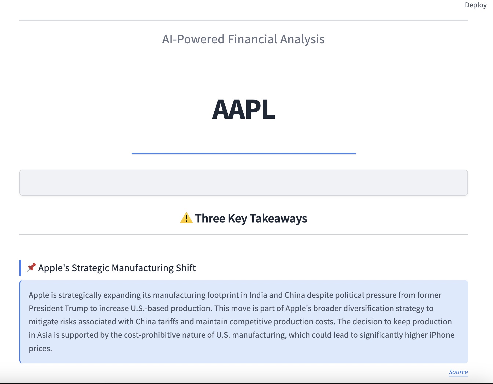
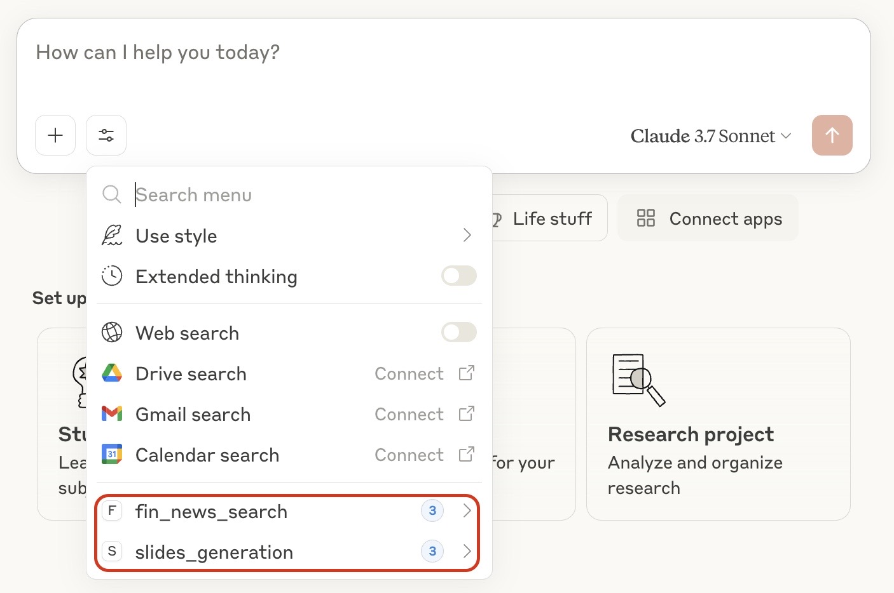

# Stock Tracker

A Python application that generates AI-powered financial analysis reports and presentations from stock ticker symbols.

## Setup

```bash
# Install dependencies
pip install -r agent/requirements.txt

# Create a .env file with your OpenAI API key
echo "OPENAI_API_KEY=your_openai_api_key_here" > agent/.env
```
### Installing `lxml`
The `lxml` library is required for HTML/XML parsing. Depending on your system, follow the instructions below.

#### macOS (Apple Silicon M1/M2)
```bash
conda install -c conda-forge lxml==4.9.3
```

#### Windows/Linux/Other macOS (x86_64)
```bash
pip install lxml==4.9.3
```

## Usage

```bash
# Run the Streamlit application
cd agent
streamlit run main.py
```

Once the application is running, you'll see an interface like this:



Enter a stock ticker symbol or company name, adjust the analysis period if needed, and click "Generate Analysis" to create your financial report.

Here is a sample report of Apple Inc.



### How to Customize Reports

You can customize various aspects of the stock analysis reports:

#### Modifying News Sources

In `news_processor.py`, you can change the RSS feeds used for news collection by modifying the `rss_urls` list in the `get_news_json` function:

```python
# Original sources
rss_urls = [
    f'https://finance.yahoo.com/rss/headline?s={ticker}',
    f'https://news.google.com/rss/search?q={ticker}+stock', 
]

# You can add or replace sources as needed, for example:
rss_urls = [
    f'https://finance.yahoo.com/rss/headline?s={ticker}',
    f'https://news.google.com/rss/search?q={ticker}+stock',
    f'https://feeds.financialcontent.com/snl/{ticker}',
    # Add more sources as needed
]
```

#### Customizing Analysis Prompts

In `financial_analyzer.py`, you can customize the AI analysis prompts to change the content and style of the generated reports:

1. Modify the `fact_extraction_prompt` to change how facts are extracted from news articles
2. Customize the `macro_prompt` to alter how macroeconomic trends are analyzed 
3. Adjust the overall report structure in the `final_prompt`

For example, to focus more on technical analysis rather than news-based analysis, you could modify these prompts to emphasize price patterns and technical indicators.

#### Customizing Presentation Style

In `ppt_generator.py`, you can customize the PowerPoint presentation style by modifying:

1. Color schemes (change RGB values for backgrounds, text, and accents)
2. Font styles and sizes 
3. Slide layouts and element positioning
4. Visual elements and formatting

For example, to change the color scheme:

```python
# Original colors
TEXT_COLOR = RGBColor(31, 41, 55)  # #1f2937 - dark text
ACCENT_COLOR = RGBColor(59, 130, 246)  # #3b82f6 - blue accent
SLIDE_BACKGROUND_COLOR = RGBColor(240, 242, 246)  # #f0f2f6 - light blue-gray

# Modified colors for a different theme (green-based)
TEXT_COLOR = RGBColor(15, 53, 43)  # Dark green text
ACCENT_COLOR = RGBColor(16, 185, 129)  # Teal accent
SLIDE_BACKGROUND_COLOR = RGBColor(240, 250, 245)  # Light mint background
```

## MCP Integration for Claude.ai

The `mcp` folder contains Model Context Protocol modules that can be integrated with Claude.ai:

```bash
# Copy the MCP modules to your existing MCP server project
cp -r mcp/* /path/to/your/mcp/server/project/
```

When successfully deployed, your MCP integration should appear in Claude.ai as follows (highlighted in red):



Follow the Model Context Protocol tutorial provided by Claude.ai for implementation details: [https://modelcontextprotocol.io/introduction](https://modelcontextprotocol.io/introduction)
